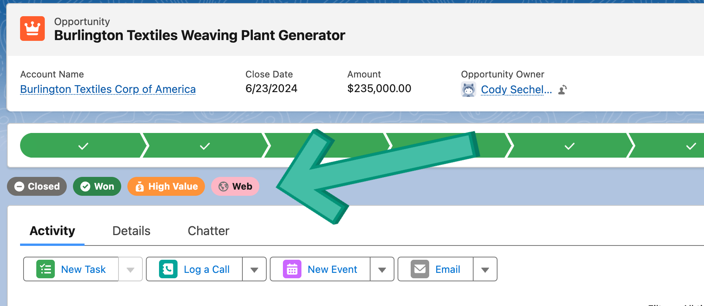

# Salesforce Opportunity Pills POC

## Purpose
This is example code for how to implement "pills" on an Opportunity record page in Salesforce. "Pills" are meant to give users a quick way to identify important information about a record, in the case an Opportunity. But this code can be adapted for any object.

## Design Principals
This code was written with the following principals in mind

### Scalability
The idea here is not to make the code infinitely scalable. This will cause the code to be harder to read and reason about, and harder to debug as well. Instead, one can assume that you might want to have no more than 30 or so pills. In my mind once you get more than 8 or 10 on the screen, user's will have to scan too much to find what they are looking for and might as well just read the field values on the detains tab.

While this code has no technical limitation (other than the max character length for an Apex class), the way the code is written assumes no more than 20 or 30 pills where each pill might have 5-15 lines of logic for each, and more and the class will start to become very large and harder to maintain.

If more pills are required, or if there is really complex logic for determining if a pill should be shown or not, or if the pill logic is likely to change often and you will need multiple developers on different pills at the same time, then I would suggest making a separate class for each pill.

### Maintainability
By keeping each button's visibility logic in it's onw method, it will be easter to read and maintain.

### Separation of Concerns
I believe the Apex controllers for Lightning Web Components (LWC) should have a cleat line of demarcation. the JavaScript for a component should not be concerned with things like the schema of an SObject, for example. For this reason, I like to create an inner class called `Client Model` that defines the API to program your LWC against. The class properties for this class should rarely change as it might be a breaking-change for the LWC.

This creates an insulation layer so that if the logic changes, or you change which field is referenced, that can all be handled in Apex and conform it's output to the Client Model

### Accessability
As far as the UI/UX is concerned, it is important to make sure that the pill colors are acceptable for color blind users and that the contract of the pill text/icon has adequate contract. To that end, the Pill LWC implements an API option to use light text or dark text. A great resource fot testing the contract between the text color and the background color is the [WebAPI Contrast Checker](https://webaim.org/resources/contrastchecker/).

Accessability aside, it is recommended that you stay within the Salesforce Lighting Design System (SLDS) color pallet to avoid colors that are jarring or looks out of place. Check out the [Design Token Colors](https://www.lightningdesignsystem.com/design-tokens/#category-color) on the [SLDS](https://www.lightningdesignsystem.com/) site for a reference.

# Contributions
This is not a maintained repo,iIt's just here to share this specific code. Pull Request and Issue will be ignored.